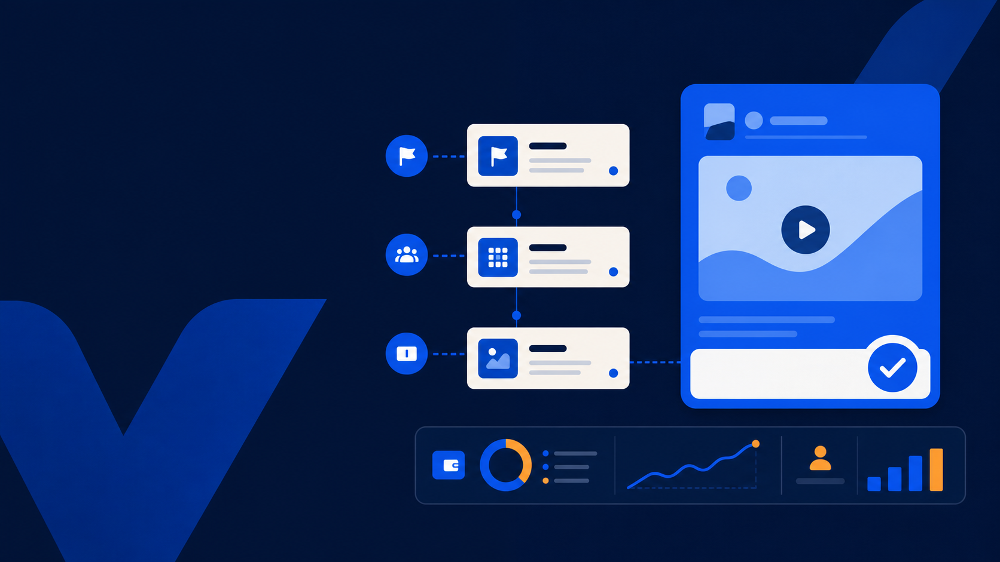

<p align="center">
  
</p>

<h1 align="center">VK Ads MCP All in One</h1>

<p align="center">Локальный MCP-сервер для анализа и безопасной работы с VK Ads.</p>

<p align="center">
  <a href="https://nodejs.org/"></a>
  <a href="https://modelcontextprotocol.io/"></a>
  <a href="LICENSE"></a>
  
</p>

Сервер подключает MCP-клиент к кабинету VK Ads: читает рекламные планы, группы и объявления, получает статистику, работает с аудиториями, медиафайлами и отчётами. По умолчанию запись выключена.

Для Codex, Claude Code, Gemini CLI, Qwen Code и Kimi Code CLI есть примеры подключения по `stdio`. Для других MCP-клиентов может потребоваться отдельная настройка.

> [!IMPORTANT]
> Для анализа публичных сообществ нужен отдельный токен Core VK API: `VK_API_TOKEN`. Он не заменяет учётные данные VK Ads и не применяется к их API.

## Быстрый старт

Нужны Node.js 20 или новее, а также `client_id` и `client_secret` приложения VK Ads.

### macOS и Linux

```bash
curl -fsSL https://github.com/sergeylopukhov/vk-ads-mcp-all-in-one/releases/latest/download/install.sh | sh
```

### Windows

Откройте PowerShell и выполните:

```powershell
irm https://github.com/sergeylopukhov/vk-ads-mcp-all-in-one/releases/latest/download/install.ps1 | iex
```

Установщик запросит `client_id`, скрытый `client_secret`, режим работы и отдельно спросит, нужен ли поиск публичных сообществ VK. Если включить функцию, он запросит `client_id` приложения VK ID и проведёт авторизацию в браузере. Дополнительные возможности записи настраиваются отдельно. Затем установщик подключит сервер к Codex.

После установки перезапустите Codex и отправьте запрос:

```text
Покажи контекст подключения VK Ads и доступные рекламные планы. Ничего не меняй.
```

Чтобы обновить сервер, снова выполните команду для своей системы. Установщик предложит сохранить текущие настройки или пройти настройку заново; профили, токены и локальный аудит не удаляются.

Каталог установки по умолчанию:

- macOS: `~/Library/Application Support/VK Ads MCP`;
- Linux: `~/.local/share/vk-ads-mcp`;
- Windows: `%LOCALAPPDATA%\VK Ads MCP`.

Для Claude Code, Gemini CLI, Qwen Code и Kimi Code CLI используйте [короткие команды подключения](readme/setup-clients.md). Разработчики могут запустить `node install.mjs --help`, чтобы выбрать ветку или другой каталог установки.

## Как создаётся и хранится токен

При первом запросе сервер получает токен VK Ads по `client_id` и `client_secret`, после чего записывает его в локальный `.env` в каталоге установки. Если VK выдаёт `refresh_token`, сервер сохраняет и его для последующего обновления.

`client_secret`, токен доступа и refresh token хранятся только в `.env`. Файл исключён из Git, не попадает в релиз и не нужен в настройках MCP-клиента. Не передавайте его другим людям.

## Разные роли VK Ads: advertiser, agency, manager, ОРД

Права определяет токен пользователя VK Ads, а не сборка MCP. Не используйте один токен для нескольких людей. Для каждого кабинета или роли создайте отдельный локальный профиль:

```bash
cd mcp-server
mkdir -p profiles
cp .env.example profiles/agency.env
open -e profiles/agency.env
```

В файле укажите учётные данные этого пользователя. Затем подключите отдельный MCP-процесс:

```bash
codex mcp add vk-ads-agency --env VK_ADS_PROFILE=agency -- node "$(pwd)/dist/index.js"
```

Профиль `agency` хранит токен и журнал write-операций в `mcp-server/profiles/agency.env` и `mcp-server/profiles/agency.vk-ads-audit.json`. Они игнорируются Git. Так же работают `manager`, `ord_partner` и другие имена профилей. Один MCP-процесс использует один профиль; переключить учётные данные через MCP нельзя.

## Что умеет сервер

| Раздел | Возможности |
| --- | --- |
| Аналитика | Статистика, сравнение периодов, ранжирование по CTR, CPC, CPA и расходу. |
| Реклама | Чтение структуры `ad_plans → ad_groups → banners`; большинство операций записи — только для тестовых объектов и с подтверждением. |
| Креативы | Проверка изображений, видео, HTML5 и параметров объявления до отправки в VK Ads. |
| Данные | Аудитории, сегменты, лид-формы, отчёты и экспорт. |
| Сообщества VK | Поиск, метаданные, анализ публичных постов, скоринг с расшифровкой и экспорт кандидатов в CSV или JSON. Списки участников не запрашиваются. |

## Публичные сообщества VK

При новой установке выберите «Включить поиск и анализ публичных сообществ VK?». Установщик запросит только `client_id` вашего приложения VK ID, откроет авторизацию в браузере, затем скрыто примет URL одноразового callback и сам сохранит access и refresh токены. При обновлении старой установки он отдельно предложит включить функцию и авторизовать VK ID, не меняя остальные настройки. Выбор «нет» оставляет функцию выключенной.

Нужен отдельный пользовательский доступ Core VK API с правами `groups` и `wall`; он не заменяет `VK_ADS_TOKEN`. До запуска авторизации создайте приложение VK ID и добавьте в его настройках доверенный redirect URL `https://vk.ru/blank.html`. Затем укажите его `client_id` установщику. Токены вручную получать и вставлять не нужно: после входа установщик попросит только URL страницы `vk.ru/blank.html` и обменяет одноразовый код сам. См. [авторизацию VK ID без SDK](https://id.vk.com/about/business/go/docs/ru/vkid/latest/vk-id/connection/start-integration/auth-without-sdk/auth-without-sdk-web).

Токены не попадают в ответы, журнал аудита и диагностические логи. Refresh-токен обновляет access-токен до старта сервера. Метаданные хранятся в памяти 10 минут. Для Core VK API действует отдельный limiter с повторами при временных ошибках.

Примеры вызовов без записи:

```text
vk_discover_communities({"keywords":["настольные игры"],"min_members":1000,"limit":50})
vk_analyze_communities({"community_ids":[1,2],"analysis_terms":["турнир"]})
vk_score_communities({"community_ids":[1,2],"scoring_rules":{"terms":["турнир"],"weights":{"name_term":25,"post_term":30,"activity_fresh":20},"min_score":50}})
vk_export_community_candidates({"communities":[...],"format":"csv"})
```

Закрытые, удалённые и недоступные сообщества отмечаются флагами. Полные тексты постов не возвращаются и не сохраняются. Поиск, анализ и экспорт не создают аудитории и не меняют рекламный кабинет.

Полный список с описаниями и разделением по категориям опубликован в [TOOLS.md](TOOLS.md). Актуальный набор для запущенного профиля также доступен через MCP-инструмент `search_tools`.

## Режим записи

Для чтения ничего настраивать не нужно. Из папки `mcp-server` запись включается только при явном запуске:

```bash
VK_ADS_MODE=write node dist/index.js
```

В режиме `write` доступны все реализованные операции записи. Перед каждой сервер проверяет данные и создаёт preview; по умолчанию агент выполняет `write_execute` только после явного согласия пользователя именно на это изменение — на любом языке, без ID и фиксированной фразы. Отказ, сомнение, вопрос или нейтральная реплика не являются согласием. Владелец локального профиля может явно отключить это требование через `VK_ADS_REQUIRE_WRITE_CONFIRMATION=0`, при этом preflight и reread сохраняются. Ограничения роли, текущего доступа к объекту и опубликованного контракта VK Ads не обходятся. Перед выполнением проверьте preview и ID.

## Ошибки подключения

- «VK Ads не выдал токен»: проверьте `VK_ADS_CLIENT_ID` и `VK_ADS_CLIENT_SECRET` в `.env`.
- `token_limit_exceeded`: не удаляйте локальный `.env`. В write-режиме используйте `vk_recover_token_limit`: он подготовит preview, а после выполнения удалит токены текущей связки `client_id—user`, выпустит один новый токен и сохранит `refresh_token`. Кампании и бюджеты операция не изменяет.
- Ошибка `403`: VK Ads отклонил запрос. Проверьте права приложения и доступ к рекламному кабинету.

Инструкции для других MCP-клиентов: [readme/setup-clients.md](readme/setup-clients.md). Короткая инструкция для Codex: [readme/setup-codex.md](readme/setup-codex.md).

Лицензия: [MIT](LICENSE). Политика безопасности: [SECURITY.md](SECURITY.md).

## Структура репозитория

Весь код и конфигурация сервера находятся в [mcp-server](mcp-server): исходники, зависимости, `.env.example` и `AGENTS.md`. В корне остаются только описание, лицензия, безопасность и изображения для страницы репозитория.
